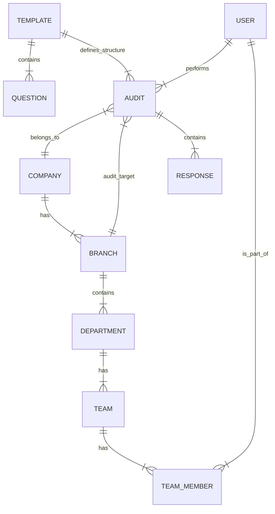

# Sistema de Gestión de Auditorías - Documentación Técnica Complet

## 1. Visión General del Proyecto

El **Sistema de Gestión de Auditorías** es una plataforma web integral diseñada para facilitar, estandarizar y analizar procesos de auditoría dentro de organizaciones. Permite a las empresas gestionar su estructura organizacional, crear plantillas de auditoría personalizadas, ejecutar auditorías en terreno, y obtener análisis detallados y recomendaciones basadas en los resultados.

### Objetivos Principales
- **Digitalización**: Eliminar el uso de papel y hojas de cálculo desconectadas.
- **Estandarización**: Asegurar que todas las auditorías sigan los mismos criterios (ISO, normativas internas).
- **Análisis**: Proveer insights inmediatos sobre el desempeño de sucursales y departamentos.
- **Acción**: Generar recomendaciones automáticas y planes de acción.

---

## 2. Arquitectura del Sistema

El sistema utiliza una arquitectura **Cliente-Servidor** moderna, separando completamente el Frontend del Backend, comunicándose a través de una API RESTful.

### Stack Tecnológico

**Frontend (Cliente Web)**
- **Framework**: React 18
- **Lenguaje**: TypeScript
- **Build Tool**: Vite
- **Estilos**: Tailwind CSS
- **Estado**: Context API + React Hooks
- **HTTP Client**: Axios (con interceptores para JWT)
- **Routing**: React Router DOM v6
- **UI Components**: Lucide React (iconos), Componentes personalizados

**Backend (API Server)**
- **Framework**: Django 5.0
- **API Toolkit**: Django REST Framework (DRF)
- **Lenguaje**: Python 3.10+
- **Autenticación**: JWT (Simple JWT)
- **Base de Datos**: PostgreSQL (Supabase)
- **Servidor WSGI**: Gunicorn

**Infraestructura & Despliegue**
- **Frontend Hosting**: Vercel
- **Backend Hosting**: Render
- **Base de Datos**: Supabase (Cloud PostgreSQL)
- **Control de Versiones**: Git (GitHub)

### Diagrama de Arquitectura (Mermaid)

```mermaid
graph TD
    User[Usuario (Navegador)] -->|HTTPS| Frontend[Frontend (Vercel)]
    Frontend -->|API REST / JSON| Backend[Backend API (Render)]
    Backend -->|SQL| DB[(PostgreSQL Supabase)]
    Backend -->|Auth| JWT[JWT Authentication]
```

---

## 3. Módulos del Sistema

### 3.1. Gestión de Empresas y Estructura
Permite modelar la jerarquía de la organización cliente.
- **Empresas**: Entidad raíz.
- **Sucursales**: Ubicaciones físicas operativas.
- **Departamentos**: Áreas funcionales dentro de una sucursal.

### 3.2. Gestión de Equipos (Teams)
Organiza a los usuarios dentro de la estructura.
- **Equipos**: Grupos de trabajo asociados a un departamento.
- **Roles**: Líderes y Miembros.
- **Jerarquía**: Gerencia, Managers, Equipos operativos.

### 3.3. Auditorías (Core)
El núcleo funcional del sistema.
- **Plantillas**: Definición de criterios, preguntas, categorías y pesos. Soporte para normas ISO (27001, 9001, etc.).
- **Ejecución**: Interfaz para realizar la auditoría, responder preguntas (Si/No/Parcial/N/A) y agregar evidencias/notas.
- **Scoring**: Cálculo automático de puntajes por respuesta, por categoría y global.

### 3.4. Análisis y Recomendaciones
Valor agregado post-auditoría.
- **Comparaciones**: Herramienta visual para contrastar el desempeño entre diferentes sucursales o períodos.
- **Recomendaciones**: Motor que detecta áreas de bajo rendimiento (<65%) y sugiere acciones correctivas automáticamente.
- **Comparativa VS**: Análisis de "brecha" entre el puntaje obtenido y el ideal de la plantilla.

---

## 4. Modelo de Datos (ERD Conceptual)

A continuación se describen las entidades principales y sus relaciones.



### Entidades Clave

1.  **User (CustomUser)**: Extiende el usuario de Django. Tipos: `owner`, `employee`, `client`.
2.  **Audit**: Instancia de una auditoría. Estados: `draft`, `in_progress`, `completed`. Almacena puntajes finales.
3.  **AuditResponse**: Respuesta individual a una pregunta de la plantilla dentro de una auditoría.
4.  **Template**: Define la estructura (preguntas, categorías) de una auditoría estándar.

---

## 5. Flujos de Usuario Principales

### 5.1. Flujo de Ejecución de Auditoría
1.  **Creación**: El auditor selecciona una Plantilla y una Sucursal/Departamento destino.
2.  **Ejecución**: Se genera un borrador (`draft`). El auditor responde las preguntas.
3.  **Finalización**: Al completar, el sistema calcula los puntajes automáticamente y cambia el estado a `completed`.
4.  **Resultado**: Se genera un reporte inmutable con los hallazgos.

### 5.2. Flujo de Recomendaciones
1.  **Selección**: El usuario selecciona una auditoría completada.
2.  **Análisis**: El sistema compara los puntajes obtenidos vs. los máximos posibles de la plantilla.
3.  **Detección**: Identifica categorías con cumplimiento < 65%.
4.  **Reporte**: Muestra alertas visuales y sugerencias de mejora.

---

## 6. Configuración y Despliegue

### Requisitos Previos
- Python 3.10+
- Node.js 18+
- PostgreSQL (opcional para desarrollo local, requerido para prod)

### Instalación Backend
Ver instrucciones detalladas en `backend/README.md`.

### Instalación Frontend
Ver instrucciones detalladas en `frontend/README.md`.

### Variables de Entorno Clave
**Backend**:
- `DATABASE_URL`: Conexión string a PostgreSQL.
- `DJANGO_SECRET_KEY`: Llave de seguridad.
- `CORS_ALLOWED_ORIGINS`: Dominios permitidos (URL del frontend).

**Frontend**:
- `VITE_API_BASE_URL`: URL del backend API (ej: `https://mi-api.onrender.com`).

---
*Generado automáticamente por Asistente de Desarrollo AI - 2026*
